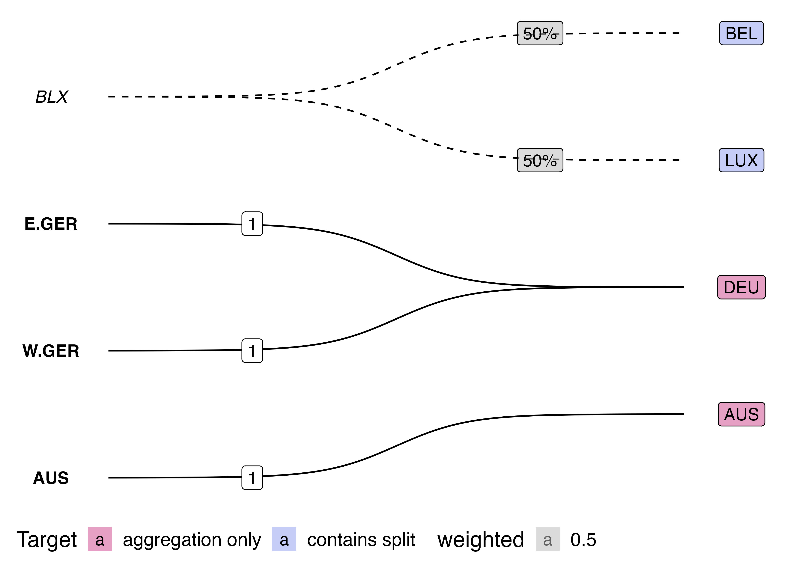

<!-- README.md is generated from README.Rmd. Please edit that file -->

```{r, include = FALSE}
knitr::opts_chunk$set(
  collapse = TRUE,
  comment = "#>"
)
```

# Attempts at visualising panel maps

This repo contains a collection of ggplot experiments for visualising panel maps use in [`{conformr}`](https://github.com/cynthiahqy/conformr) documentation

<!-- badges: start -->

<!-- badges: end -->

## Experiments

This is this mapping (recorded as graph edges) I tried to visualise:

```{r, echo=FALSE}
source("R/edges.R")
edges
```

ggplot extensions I experimented with (code in `R/` folder):

-   `{ggraph}`: way too flexible, no sensible way to keep the `from`, and `to` nodes lined up. Found some good `{tidygraph}` and `{ggraph}` resources though:
    -   <https://mr.schochastics.net/material/netVizR/>

    -   <https://dgarcia-eu.github.io/SocialDataScience/4_SNA/045_Tidygraph/tidygraph.html>
-   [`{ggsankey}`](https://github.com/davidsjoberg/ggsankey): keeps `from` and `to` nodes stacked in "stages", and connects nodes in each stage with "flow" ribbons
    -   [sankey diagram defintion and use cases](https://www.data-to-viz.com/graph/sankey.html)
    -   [sankey diagram gallery/blog](https://www.sankey-diagrams.com/page/2/)
-   [`{ggalluvial}`](https://github.com/corybrunson/ggalluvial): terminology in documentation (lodes/alluvia/stratum..) was a bit difficult to follow (use [cheatsheets!](https://jtr13.github.io/cc21fall2/ggalluvial-cheatsheet.html)); too rigid for my purposes, and rescaling of `weighted` as flows between nodes obscures the weight information
-   [`{ggbump::geom_bump}`](https://github.com/davidsjoberg/ggbump#tutorial): removes the "flow" to line-width connection from sankey/alluvials, and adds some flexibility for node positioning, but is annoyingly restrictive requirements for `aes()` mapping -- couldn't quite map data into "rank" format
-   [`{ggbump::geom_sigmoid}`](https://github.com/davidsjoberg/ggbump#sigmoid-curves-examples): more flexible geom that probably powers `geom_bump()`, just requires calculation of starting and ending x,y coordinates for each set/stage of nodes.

Aside on errors when reproducing the map with sigmoid curves from `ggbump` readme:

-   [original code](https://github.com/davidsjoberg/tidytuesday/blob/master/2020w17/2020w17_skript.R) vs. [modified code for sf \> 1.0](R/ggbump-sigmoid-map.R)
-   need to turn off s2 spherical geometry using `sf_use_s2(FALSE)` -- see [github issue](https://github.com/r-spatial/sf/issues/1759)
-   might have been calling the wrong version of `format()` but changing `digits = 0` to `digits = 1` seemed to fix the error

## Visualisation Results

labelled sigmoid plot: [code](R/ggbump-sigmoid-graph-edges.R)

-   renormalising the nodes/labels to fit within a range there is not enough space ([use this code](https://github.com/davidsjoberg/tidytuesday/blob/678e15f20decaa98bd3ebd8c1f3eadc598202f36/2020w17/2020w17_skript.R#L26))


```{r}
source("R/ggbump-sigmoid-graph-edges.R")
```


sankey flow diagram using `{ggsankey}`: [code](R/ggsankey.R)

 

alluvial plot using `{ggalluvial}`: [code](R/ggalluvial.R)

{width="445"}

# Matrix Equivalence and Panel Map Conditions

Graphs can also be represented in matrix form:
```{r pm-matrix}
pm_mtx <- source("R/edges-to-matrix.R")$value
pm_mtx
```

Notice the condition that weights sum to one can be checked by simply summing up each row:
```{r pm-matrix-conditions}
## weights sum to one
col_ones <- matrix(1, nrow=nrow(pm_mtx))
pm_mtx %*% col_ones == 1
```

apply the transformation:
```{r}
src_val <- matrix(100, nrow=nrow(pm_mtx))
(new_val <- t(pm_mtx) %*% src_val)
```

Notice that we get equivalent totals for "free" because the weights in each row sum to one:
```{r}
sum(src_val) == sum(new_val)
```

The coverage test is equivalent to a conformability condition.
```{r error=TRUE}
## add an extra source class
bad_x <- rep_len(100, nrow(pm_mtx) + 1)
## now we cannot use the panel map
t(pm_mtx) %*% as.matrix(bad_x)
```

Panel maps are uni-directional except for one-from-one mappings
```{r}
(pm_mtx %*% new_val) == src_val
```

